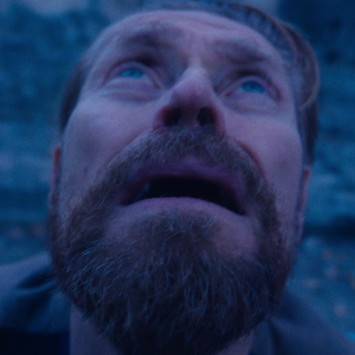

# This repository contains implementations of several simple computer graphics programs using Ash, GLFW, and ImGui.
[vulkan_wr](src/vulkan_wr) — a wrapper for the Vulkan API + app structure.<br>
[Wrapper for GLFW](src/window.rs).<br>
[Wrapper for ImGui](src/vulkan_wr/ImGui_wr.rs). <br>
* Lab 1 (a simple 3D object) is located in the [sphere](src/scenes/sphere) and [common files](src/scenes/common) (uses sphere.* shaders).
* Labs 2 and 3 (lighting + textures) are located in the [lighting](src/scenes/lighting) and [common files](src/scenes/common) (uses light.* shaders).
* Lab 4 (shadows) is located in the [dynamic](src/scenes/dynamic) and [shadows](src/scenes/shadows) files (uses light_shadows.* and shadows.* shaders).
* [Shaders for all labs](shaders)

# Build
For a debug build, use::
```
cargo build
```
To run a debug build, use:
```
cargo run
```
For a release build, use:
```
cargo build --release
```
To run a release build, use:
```
cargo run --release
```
You can select the desired scene using [Cargo.toml](Cargo.toml) by setting the value 'default=["sceneN"]'.



